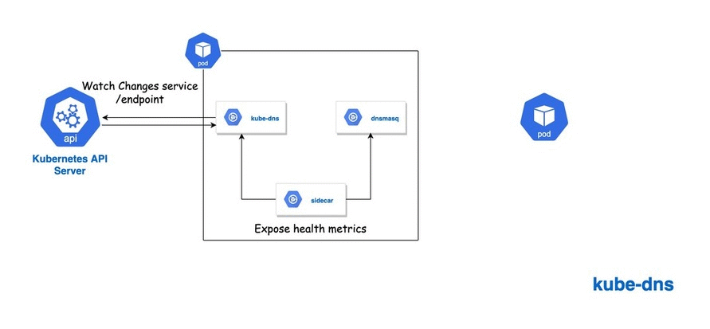

# Kubernetes DNS

Kubernetes DNS or kube-dns is a DNS based service discovery on Kubernetes Cluster for defining DNS naming rules and resolving cluster IP of the service.

The [kube-dns](https://github.com/kubernetes/dns) service prior to Kubernetes 1.11 is made up of three containers running in a kube-dns pod in the kube-system namespace. As of Kubernetes v1.12, [CoreDNS](https://coredns.io/manual/toc/) is the recommended DNS Server, replacing kube-dns.

# How Does Kubernetes DNS Work

As already mentioned currently Kubenretes DNS system can be setup either using CoreDNS or Kube-DNS. Regardless of the software handling DNS, both the add-ons schedule POD or PODs and a service with a Cluster IP.

As you can see below, its just a Kubernetes Service with cluster IP and port 53(well DNS) with 2 endpoints.

```bash
$ kubectl describe services kube-dns --namespace=kube-system

Name:              kube-dns
Namespace:         kube-system
Labels:            k8s-app=kube-dns
                   kubernetes.io/cluster-service=true
Selector:          k8s-app=kube-dns
Type:              ClusterIP
IP:                10.0.0.10
Port:              dns  53/UDP
TargetPort:        53/UDP
Endpoints:         10.1.0.106:53,10.1.0.73:53
Port:              dns-tcp  53/TCP
TargetPort:        53/TCP
Endpoints:         10.1.0.106:53,10.1.0.73:53
Session Affinity:  None
Events:            <none>
```

## But how containers get this static Cluster IP?

Here comes the [kubelet](https://kubernetes.io/docs/reference/command-line-tools-reference/kubelet/). `kubelet` is responsible for scheduling container and ensures that those are running and healthy. Kubelet sets each new container's `/etc/resolv.conf` with cluster IP of the kube-dns service as a nameserver, with appropriate search options to allow for shorter hostnames to be used.

If you check the kubelet process running on each k8s nodes, you will notice the `--cluster-dns` (kube-dns cluster IP) and `--cluster-domain` (default local domain) flag as shown below:

```bash
$ ps -ef | grep kubelet

/usr/local/bin/kubelet --enable-server --cluster-dns=10.0.0.10 --cluster-domain=cluster.local --node-labels=node-role.kubernetes.io/agent=,kubernetes.io/role=agent,agentpool=k8spool --address=0.0.0.0 --allow-privileged=true --authorization-mode=Webhook --azure-container-registry-config=/etc/kubernetes/azure.json --cgroups-per-qos=true --cloud-config=/etc/kubernetes/azure.json  --enforce-node-allocatable=pods --event-qps=0 
```

Note: Trimmed output

Lets check this in real:

- Create a deployment with 2 Pods running nginx, I am gonna use the Deployment from Kubernetes Examples: [nginx.yaml](https://raw.githubusercontent.com/kubernetes/website/master/content/en/examples/service/networking/run-my-nginx.yaml)

    ```bash
    $ kubectl create -f nginx.yaml
    deployment.apps/my-nginx created
    ```

    ```bash
    $ kubectl get pods
    NAME                                               READY   STATUS    RESTARTS   AGE
    my-nginx-756f645cd7-99pbm                          1/1     Running   0          27s
    my-nginx-756f645cd7-vdpkn                          1/1     Running   0          27s
    ```

- Read /etc/resolv.conf of one of the POD:

    ```bash
    $ kubectl exec -it my-nginx-756f645cd7-99pbm cat /etc/resolv.conf
    nameserver 10.0.0.10
    search default.svc.cluster.local svc.cluster.local cluster.local
    options ndots:5
    ```

Here we go, kube-dns static Cluster IP `10.0.0.10` is set as a DNS nameserver for our containers. Applications running in containers can then resolve the other services IP using this nameserver.

## But how kube-dns service does the magic?

The kube-dns service listens for service and endpoint events from the Kubernetes API and updates its DNS records as needed. These events are triggered when you create, update or delete Kubernetes services and their associated pods.

Let's take a look at both the addons which works under the hood for kube-dns service:

### kube-dns

 

 As you can see, kube-dns pod made of three containers:

- `kube-dns`: watches the Kubernetes master for changes in Services and Endpoints, and maintains in-memory lookup structures      to serve DNS requests.
- `dnsmasq`: a popular lightweight DNS resolver and cache that caches the responses from kube-dns container.
- `sidecar`: a sidecar container that handles metrics reporting and responds to health checks for the service.

### CoreDNS

As of Kubernetes v1.12, [CoreDNS](https://coredns.io/manual/toc/) is the recommended DNS Server, replacing kube-dns.

CoreDNS is a single process, written in Go, that covers all of the functionality of the existing `kube-dns` pod. A single container resolves and caches DNS queries, responds to health checks, and provides metrics.

Moreover CoreDNS is modular and pluggable, and each plugin adds new functionality to CoreDNS. This can be configured by maintaining a [Corefile](https://coredns.io/2017/07/23/corefile-explained/), which is the CoreDNS configuration file. A cluster administrator can modify the ConfigMap for the CoreDNS Corefile to change how service discovery works.